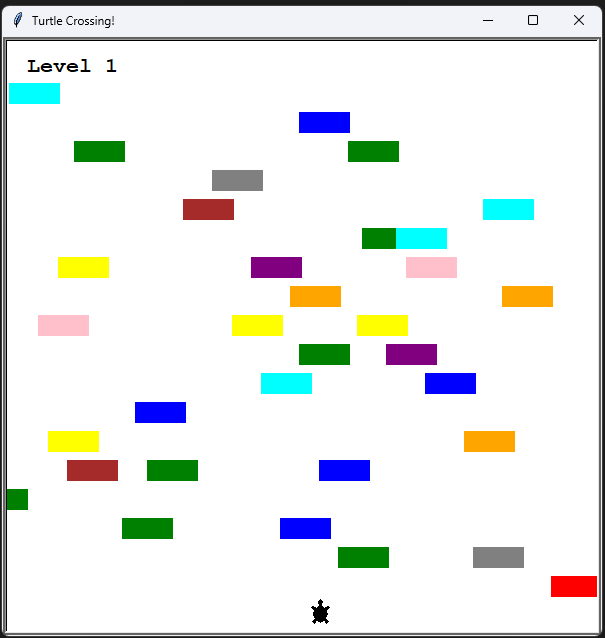

# Turtle Crossing Game
A simple **Turtle Crossing** game built with Python's `turtle` library.  
The goal is to navigate the turtle safely across the screen, avoiding obstacles while the game gradually increases in difficulty.

## Screenshot  


## How to Play  
- Use the **arrow keys** to move the turtle.
- Avoid **obstacles** that move across the screen.
- Reach the **top row** to level up.
- The game **gets harder** as obstacles spawn faster and move quicker.
- **If you collide with an obstacle, it's Game Over!**

## Installation & Running the Game
### **1. Clone the Repository**
```sh
git clone https://github.com/bfagundes/python-turtle-crossing.git
cd python-turtle-crossing
```

### **2. Install Dependencies**
This game only requires Python. Make sure you have it installed:
```sh
python --version  # Ensure Python 3.x is installed
```

### **3. Run the Game**
```sh
python main.py
```

## Controls  
| Key  | Action |
|------|--------|
| Up Arrow    | Move Up    |
| Down Arrow  | Move Down  |
| Left Arrow  | Move Left  |
| Right Arrow | Move Right |
| R           | Restart Game |

## Features
**Randomized Obstacles:** Obstacles move at different speeds and have different colors.  
**Difficulty Scaling:** Obstacles move **faster** and spawn **more frequently** as you level up.  
**Simple & Fun Mechanics:** Easy to learn, but challenging to master!  
**Restart Option:** Press `R` to restart the game without quitting.  

## Contributors  
**Bruno Fagundes** (me) - *Game Developer*  
Feel free to contribute! Fork the repository and submit a pull request.  

## License  
This project is licensed under the **MIT License**. See the `LICENSE` file for details.